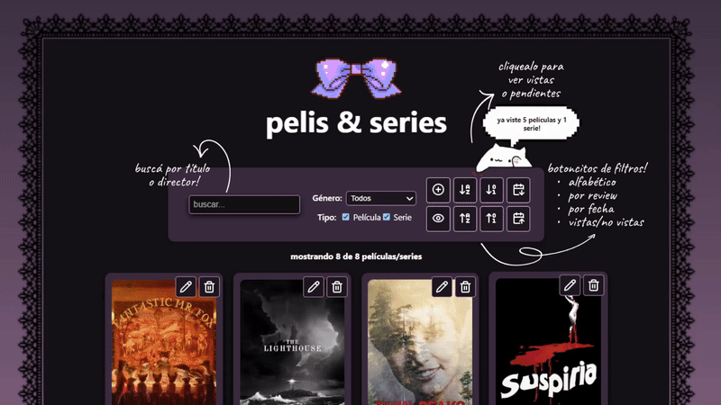

───────────────────────────────୨ৎ───────────────────────────────
# *TPO 2 - React 𖹭.ᐟ* 
[¡Click para ejecutarlo en Vercel! ૮₍ ´ ꒳ `₎ა](https://letterboxd-vert.vercel.app/)

# ୨ৎ Grupo "corazon" ᰔ
Integrantes:                           
- Alias Paula FAI-[5103] ୨ৎ
- Moreno Gisella FAI-[4201] ୨ৎ

# ୨ৎ ¿De qué trata el proyecto? ᰔ
El proyecto realizado es un gestor personal de películas y series.
Se dispone de las siguientes funcionalidades:

♡  Añadir nuevas entradas por medio de un formulario.

♡︎  Los registros pueden editarse y también eliminarse.

♡︎  Se proporciona una gran y poderosa herramienta de filtro, donde se pueden filtrar 
todos los registros existentes a gusto del usuario. 
Los criterios de filtrado son los siguientes:
- Barra de búsqueda (buscar por título)
- Género
- Tipo (película/serie)
- Visualización (vista o no vista)
- Orden alfabético (A-Z y Z-A)
- Review/valoración (creciente y decrecientemente)
- Orden alfabético (A-Z y Z-A)
- Orden cronológico (creciente y decrecientemente)

Todos los filtros seleccionados funcionan en conjunto.

♡︎  Se cuenta con un asistente gatuno que al momento de clickearlo, le informa al usuario 
cuantas películas y series vio, así como también, cuantas 
películas y series están esperando en su watchlist.

<p align="center">
    
</p>

# ୨ৎ Instrucciones de instalación ᰔ
1. Dentro de tu IDE de preferencia, posicionarte 
    en la carpeta donde deseas guardar el proyecto.
    Ingresar en la consola el comando:
    ```markdown
    git clone https://github.com/pirotonta/letterboxd
    ```
    
3. Acceder a la carpeta recién creada con el proyecto,
    e instalar las dependencias necesarias:
    - Node JS 🡆 https://nodejs.org/en/download
    - Instalar Lucide (para iconos)
    ```markdown
    npm install lucide-react
    ```

4. Ingresar en la consola los siguientes comandos:
    ```markdown
    npm install
    ```
    ```markdown
    npm run dev
    ```
6. Enjoy ૮ ˶ᵔ ᵕ ᵔ˶ ა .ᐟ.ᐟ

# ୨ৎ Función de archivos iniciales ᰔ
1. index.jsx: Es el punto de entrada principal en la aplicación. Es el archivo donde se conecta React
con el DOM real. Importa el componente <App/> y lo renderiza.</App>

2. index.css: Acá se encuentran los estilos CSS base del proyecto. Se utiliza para definir estilos generales,
como por ejemplo, los márgenes, fuentes, reseteo de estilos, o clases globales.
index.jsx lo importa para que dichos estilos estén en toda la aplicación.

3. App.jsx: Es el primer componente de React que se usa, donde se construye la estructura de la aplicación.
Es un componente funcional que incluye otros componentes. En nuestra app, el componente <App/>
renderiza el componente <Home/>, que es el encargado de tener todas las funcionalidades y componentes
restantes utilizados en el proyecto.

4. package.json: Este archivo se encarga de varias cosas, entre ellas:
   - Guardar los detalles del proyecto (nombre, versión, tipo, etc.)
   - Listar las dependencias del proyecto (por ejemplo, lucide-react, react, react-dom)
   - Configurar scripts que pueden correr (por ejemplo, npm run dev, npm run build, npm run lint, etc.)


───────────────────────────────୨ৎ───────────────────────────────
